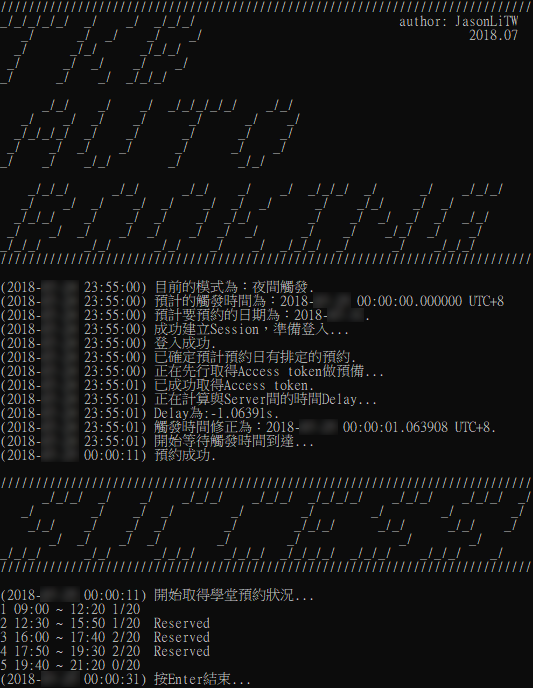
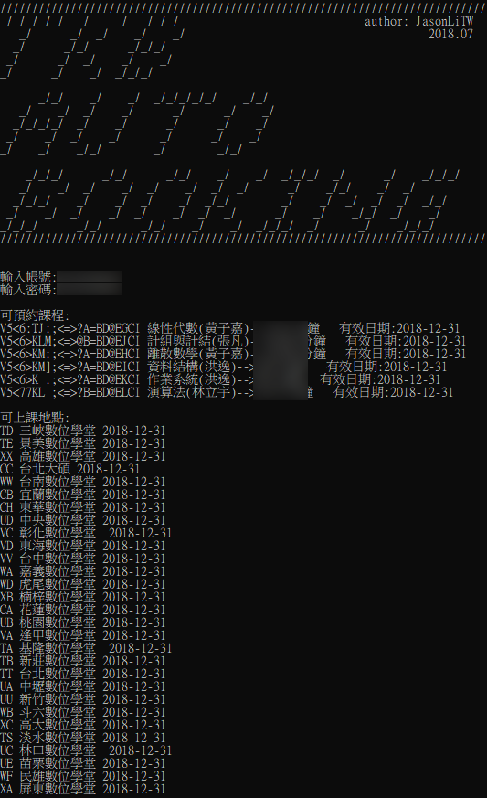

# tkb-auto-booking



因為常常忘記預約研究所的補習班，而且暑假的時候特別難預約，就決定來寫一支自動訂位(搶位)的程式了。

### 請注意
本專案僅供學術研究使用，不負任何責任，~~低調一點可以用久一點~~。

|Name|Description|
|----|----|
|schedule.py|自動訂位腳本|
|testing.py|供取得訂位相關代碼用|
|booking.py|訂位相關操作|
|structure.py|訂位相關操作|

## Requirements
- Windows 10 / macOS 10.13+ / Ubuntu 16.04+
- Python 3.6+

## Python Dependencies
|Name|Version|
|----|----|
|requests|2.18.4|
|beautifulsoup4|4.6.0|
|lxml|4.1.1|

## Usage
```schedule.py```即為自動訂位腳本，執行時必須包含-a(--account), -p(--password), -t(--txtpath)三個參數，--nocheck為選用：

|Parameter|Description|Required?|
|----|----|:----:|
|-a|帳號(身分證字號)|V|
|-p|密碼|V|
|-t|預約設定檔路徑|V|
|--nocheck|不檢查是否可預約，較為快速|-|

e.g. ```python C:\script\schedule.py -a A123456789 -p 12345678 -t C:\task.txt```

```python C:\script\schedule.py -a A123456789 -p 12345678 -t C:\task.txt --nocheck```

----

接著，預約設定檔的格式為：
```日期*地點*課號*時段```

- 日期的格式為YYYY-MM-DD
- 時段請以空白隔開，最後一個時段後面不須加空白
- 課程及地點的代號，下方會提到如何取得

e.g.
```
2018-12-01*CC*V5<6>KM:;<=>?A=BD@EHCI*2 3 4
2018-12-02*CC*V5<6>KM:;<=>?A=BD@EHCI*3
2018-12-03*CC*V5<6>KM:;<=>?A=BD@EHCI*1 2
```
即表示接下來幾天要預約```2018-12-01```的```2、3、4```時段，在上課地點代號為```CC```的地方上課程代碼為```CC*V5<6>KM:;<=>?A=BD@EHCI```以及後續兩天的課。

而個人課程以及地點代碼，可以透過執行```testing.py```（執行時不須包含上述參數）後登入取得（如下圖）：



----

請利用系統內建的排程功能(```Windows:工作排程器```/```macOS:Automator```/```Ubuntu:cron```)來設定在下列任一時間點排程執行```schedule.py```：

|Time|Description|
|:-----:|------|
|23:55|啟動等待00:00開放的位置(建議)|
|11:55|啟動等待12:00開放的第二波位置(如果有剩)|

在```12點(含)前```執行，會判斷是```中午模式```，預計訂位日期會是```當天+6天```，而觸發時間會設為```12:00```；在之後執行，會判斷是```夜間模式```，預計訂位日期會是```當天+7天```，而觸發時間會設為```00:00```

執行```schedule.py```後，會依序執行：
- 登入
- 檢查+6/7天後是否有預約
- 取得訂位頁面的Access token
- 計算Server與本地端的時間差，修正觸發時間
- 等待觸發時間到達
- 執行訂位

## Schedule
不管哪一個OS，給排程器的最好都要是**絕對路徑**。

----

#### Windows工作排程器(taskschd.msc)

以系統管理員執行：
```SCHTASKS /CREATE /TN script\auto-booking /SC DAILY /ST 23:55 /TR "python $Script -a $Account -p $Password -t $TxtPath --nocheck" /IT /RL HIGHEST```

- ```$Script```替換為```schedule.py```路徑(e.g.```C:\Script\schedule.py```)
- ```$Account```替換為網站的帳號
- ```$Password```替換為網站的密碼
- ```$TxtPath```替換為預約設定檔的路徑
- ```--nocheck```自行決定加入與否

e.g.
```SCHTASKS /CREATE /TN script\auto-booking /SC DAILY /ST 23:55 /TR "python C:\Script\schedule.py -a $A123456789 -p 123456 -t C:\Script\task.txt --nocheck" /IT /RL HIGHEST```

可以開啟工作排程器(```taskschd.msc```)檢視是否成功新增，或是用```SCHTASKS```指令檢視。

另外，請確認python路徑有在"系統"環境變數中，若僅在"使用者"環境變數中會無法由排程器執行。

----

#### macOS Automator

待補.

----

#### Ubuntu Crontab
執行
```crontab -e```

加入
```55 23 * * * root $Python $ScriptPath -a $Account -p $Password -t $TxtPath --nocheck```

- ```$Python```替換為```python```路徑(e.g.```/usr/bin/python```)
- ```$Script```替換為```schedule.py```路徑(e.g.```/Users/user/Desktop/schedule.py```)
- ```$Account```替換為網站的帳號
- ```$Password```替換為網站的密碼
- ```$TxtPath```替換為預約設定檔的路徑
- ```--nocheck```自行決定加入與否

完成後執行
```crontab -l```確認。